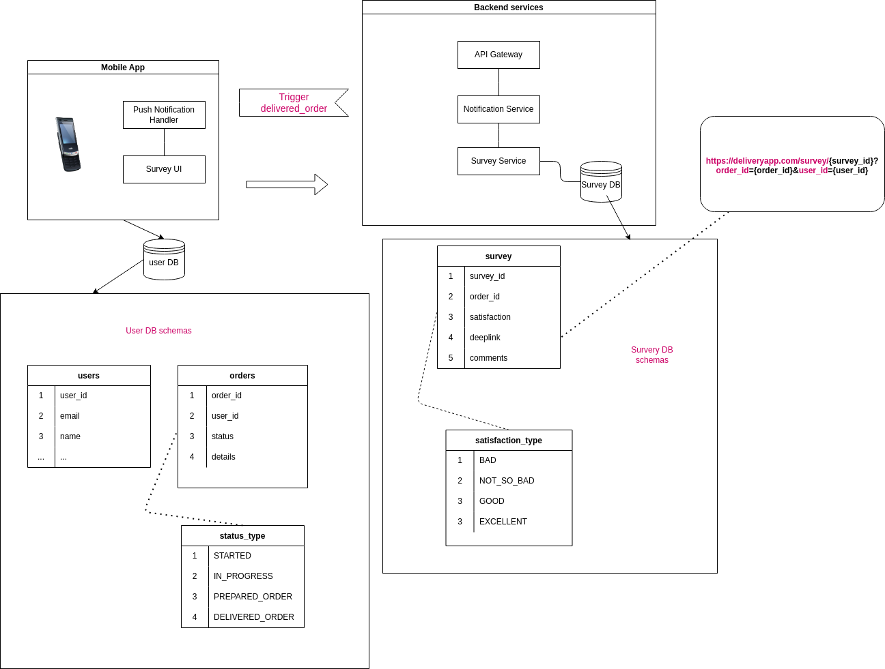

# Delivery Order Notification and Survey Service

## Overview

This application is designed to enhance customer engagement and gather valuable feedback by sending push notifications with deep links to satisfaction surveys when a delivery order is marked as delivered. The service ensures timely and relevant communication with customers, helping businesses improve their delivery operations and customer satisfaction.

## Key Features

- **Event-Driven Architecture**: The application listens for `delivered_order` events to trigger notifications.
- **Push Notifications**: Sends push notifications to customers' mobile devices with a deep link to a survey.
- **Customer Surveys**: Collects customer feedback through surveys linked in the notifications.
- **Scalable and Reliable**: Built to handle high volumes of events and notifications efficiently.

## How It Works

1. **Order Delivery Event**: The application is triggered when an `delivered_order` event is detected. This event is typically generated by the delivery management system when an order is successfully delivered to the customer.
  
2. **Generate Deep Link**: Upon receiving the event, the application generates a deep link that directs the customer to a satisfaction survey.
  
3. **Send Push Notification**: The deep link is included in a push notification sent to the customer's mobile device. The notification encourages the customer to complete a brief survey about their delivery experience.
  
4. **Collect Feedback**: When the customer clicks the deep link, they are taken to a survey form. The collected feedback is stored in a database for analysis and reporting.
  
5. **Analyze and Improve**: The feedback data is used to generate insights and identify areas for improvement in the delivery process.

## Technologies Used

- **Backend**: The application logic is implemented using a Go backend framework 
- **Event Handling**: Uses a messaging or event streaming service (e.g., RabbitMQ, Kafka) to listen for and process `delivered_order` events.
- **Push Notifications**: Integrates with a push notification service (e.g., Firebase Cloud Messaging, Apple Push Notification Service).
- **Database**: Stores survey responses in a database (PostgreSQL, MongoDB).

## Getting Started

### Prerequisites

- A running instance of the delivery management system that generates `delivered_order` events.
- Access to a push notification service to send notifications.
- A database for storing survey responses.

### Usage

Once the application is running, it will automatically listen for `delivered_order` events. When an event is detected, it will generate a deep link to a survey and send a push notification to the corresponding customer.

### Customization

- **Survey Form**: Customize the survey form to include the questions you want to ask your customers.
- **Notification Message**: Customize the push notification message to better fit your brand and communication style.

## Contributing

We welcome contributions! Please fork the repository and create a pull request with your changes. Make sure to update tests as appropriate.

## Contact

For any inquiries or issues, please contact [bareiro.romina@gmail.com](mailto:bareiro.romina@gmail.com).

## Diagrams

